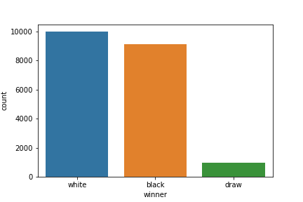
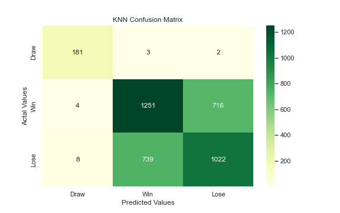

# MVP

### 1.Summary
    
   This an initial commit regarding my findings and understanding during exploration of the chess dataset , The analysis is still at early stage. There is much work ahead. 
   
   **The main question remain the same as proposal:** which opening moves provides white a better change to win .

### 2.Findings 

   * My first observation is that dependant column **(traget)** datapoints are imabalancned as per below figure.
   
   
   
   
   * Also observed a number of complete string data that may be useful for another field question. but not this one. 
   
   

### 3.Conclusion and Future Direction
   Starting with logistic regression as The base model, which scored around 67%. With the following scoring metrics: 
    
   
|              |   precision |   recall |   f1-score |     support |
|:-------------|------------:|---------:|-----------:|------------:|
| 0            |    0.994778 | 0.957286 |   0.975672 |  398        |
| 1            |    0.664654 | 0.711763 |   0.687402 | 4021        |
| 2            |    0.649175 | 0.600555 |   0.623919 | 3605        |
| accuracy     |    0.673978 | 0.673978 |   0.673978 |    0.673978 |
| macro avg    |    0.769536 | 0.756535 |   0.762331 | 8024        |
| weighted avg |    0.674074 | 0.673978 |   0.673179 | 8024        |

   The below confusion matrix shows a huge chunk of targets mis-predicted, the effect of imbalances and probably some scaling needs to be done.
    
   
   
   It's hard to say that the model is an adequate fit without comparing it to other models for the time being. 
    
   Moving on , I will run dataset on different models, at least 4 models. and summarize the finidings into a final report/presentation.
   Before that I should dig deeper into feature selection and investigate any coorelations between the features and the target.
    
   I would like to also resolve the imbalance issue by upsampling , undersampling or SMOTE. 
    
   Optional: I may explore the possiblitiy of utulizing the recommendation system to recommend a next best move.
   
   

